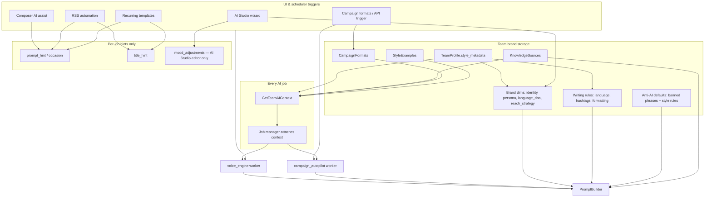
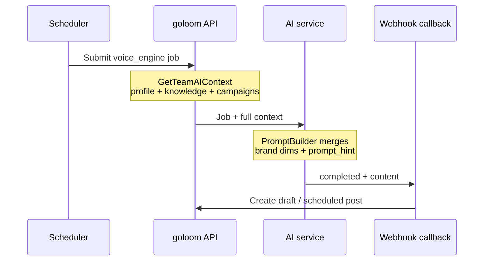

AI features are **optional** and **per workspace**. An administrator enables them in [Team settings](/docs/guides/teams/) and configures the AI service URL. The admin **AI Agents** tab lists all AI-enabled teams.

When disabled, AI menu items are hidden for that workspace.

## Brand profile (single source of truth)

The **AI Studio** wizard (`KI Studio` in the UI) is where you configure the team brand profile once. It replaces the old separate “Voice profile” and “Generate post” screens.

The profile is stored in `TeamProfile.style_metadata` and split into four open-ended dimensions. All fields are free text so the profile works for any niche — a tech podcast sounds nothing like a dentist or a creative agency:

| Dimension | Free-text fields |
|-----------|------------------|
| **Identity** | Archetype (`Tech Podcast`, `Zahnarztpraxis`, `Solo Indie Dev`, `Boutique Werbeagentur`…), voice persona (the real person behind the account), industry, main value, target audience |
| **Language DNA** | Sentence style, humor, preferred words, signature phrases, additional banned words |
| **Reach strategy** | Hook style, CTA focus |
| **Knowledge base** | Text snippets, fetched URLs — the model must not invent facts outside these sources |

Additional writing rules (formatting rules, max hashtags, preferred language) complement the brand dimensions in prompts.

### Anti-AI-speak defaults

Every prompt automatically merges a curated **anti-AI-speak** layer so generated posts do not read like generic LLM output:

- **Banned by default**: tells like `tauche ein`, `spannend`, `revolutionär`, `in einer welt, in der`, `game-changer`, `let's dive in`, `delve into`, `seamless`, `cutting-edge`, `it's not just X, it's Y` and more.
- **Style rules**: no rhetorical scene-setters, no three-part lists, no decorative em-dashes, no closing summary, sentence fragments are encouraged, etc.

Teams that want full control can tick **„Standard-KI-Phrasen-Block deaktivieren“** in AI Studio — the override is stored as `language_dna.anti_ai_override` and only the team's own banned words apply.

### AI-assisted profile creation

Step 1 of the wizard exposes a **„Profil von KI erstellen lassen“** assistant. The user writes a 2–4 sentence brief (who they are, who they post for) and the AI proposes a complete profile (archetype, persona, language DNA, reach strategy, banned/preferred words, signature phrases). The proposal is pre-filled into the form and remains fully editable before saving.

Implementation: the new `profile_assistant` AI job type — same trigger / SSE pipeline as every other AI job.

### Architecture overview

**Key rule:** All generation paths load the **same** team context. Brand dimensions and knowledge sources apply everywhere once saved in AI Studio. Automation rules do not maintain a separate voice profile — only optional **task hints** (`prompt_hint`, `title_hint`).

## AI Studio (3-step wizard)

1. **Setup** — Optionally start with the **AI assistant** (write a short brief, get a full profile draft). Then fine-tune the four brand dimensions and knowledge sources. After saving, an optional **vibe preview** summarizes how the voice sounds.
2. **Task** — Enter the occasion (text, URL, or RSS link), pick output format (post, teaser, poll, thread), and select target accounts.
3. **Editor** — Review generated text, apply mood sliders (more expertise, shorter, remove marketing speak), preview the assembled prompt, and save as draft or open in the composer.

## How automation uses the brand profile

Automation does **not** duplicate brand settings. RSS feeds and recurring post templates add **job-level hints** on top of the shared profile.

### RSS feeds

When **AI enhance** is enabled on a feed:

| Field | Role |
|-------|------|
| `prompt_hint` | **Required.** Task-specific instruction for this feed (e.g. “summarize for developers”, “always link to our changelog”) |
| `title_hint` | Internal post title guidance |
| RSS article fields | Factual source (`rss_article_title`, content, link) passed into refine mode |

The scheduler runs `voice_engine` in **refine mode**: template text + RSS article facts are rewritten using the **full brand profile** from AI Studio. Use `prompt_hint` when a feed needs a different angle than another feed — not a separate “tonality” field.

### Recurring post templates

Same pattern as RSS:

| Field | Role |
|-------|------|
| `ai_enhance_enabled` | Gate AI rewrite for main post |
| `ai_enhance_announcement` | Optional AI teaser before the main post |
| `prompt_hint`, `title_hint` | Per-template task hints |

### Composer AI assist

From the post composer, **Optimize with AI** triggers `voice_engine` in refine mode:

- Uses the **full brand profile** from context
- `prompt_hint` = optional user instruction (default: improve clarity while preserving voice)

### Campaign formats

Campaign formats are **templates**, not brand settings. `structure` (topic, tone, sections) defines a recurring series blueprint. When a format is selected:

- Brand profile + knowledge base still apply via context
- `structure.tone` is a **campaign-level** hint, separate from brand language DNA
- `campaign_autopilot` jobs are triggered via API; there is no scheduler cron for them yet

## Override matrix

| Surface | Reads brand profile | prompt_hint | title_hint | mood / output format |
|---------|--------------------|-------------|------------|----------------------|
| AI Studio | writes profile | occasion | — | yes |
| RSS feeds | yes | yes (required) | yes | no |
| Recurring templates | yes | yes | yes | no |
| Composer assist | yes | yes (instruction) | no | no |
| Campaign autopilot | yes | built from structure | — | no |

## Live job updates (SSE)

goloom streams AI job progress over **Server-Sent Events** so the UI updates without refreshing. The same stream covers AI Studio jobs, composer optimization, and automation-triggered jobs.

## Deployment note

The AI worker runs as a separate service (default port `8090` in development). The goloom binary forwards jobs and receives callbacks; both services must share network access and configuration documented in [Configuration](/docs/getting-started/configuration/).

## API and agents

Agents can trigger the same flows via team-scoped API endpoints (`POST /v1/teams/{id}/ai-trigger`) and listen for job completion. `GET /v1/teams/{id}/ai-context` returns the same bundle the workers receive (profile, knowledge sources, campaign formats, style examples, recent posts).

## Related guides

- [Teams](/docs/guides/teams/) — enable AI per workspace
- [Review queue](/docs/guides/review-queue/) — approve generated drafts
- [Automation](/docs/guides/automation/) — AI-enhanced RSS and recurring posts
